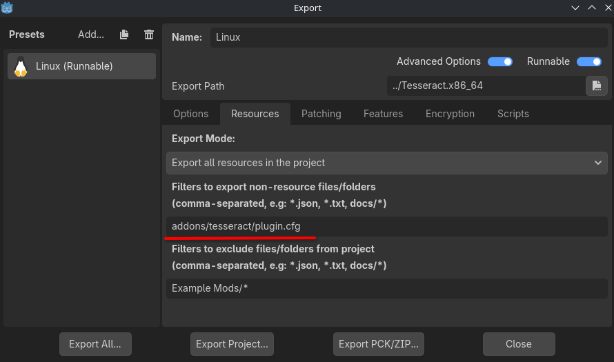

<div align="middle">

</img>

**Version:** 0.0.1

Tesseract is a modding platform for Godot 4.6 that gives both modders & game developers the tools they need to easily implement seamless mods.

</div>

---

# Table of contents
- [Features](#features)
  - [Load from ZIP or folder](#load-from-zip-or-folder)
  - [No unnecessary bundling](#no-unnecessary-bundling)
  - [Runtime unloading](#runtime-unloading)
  - [Browse mod files & directories](#browse-mod-files-&-directories)
  - [Extensive sandboxing](#extensive-sandboxing)
  - [Detailed metadata](#detailed-metadata)
- [Plugin setup (games)](#plugin-setup-games)
- [Plugin setup (mods)](#plugin-setup-mods)
- [Install & use mods](#install-&-use-mods)
- [Create a basic mod](#create-a-basic-mod)
- [A guide on creating moddable games](#a-guide-on-creating-moddable-games)

# Features
## Load from ZIP or folder
Tesseract can load mods from ZIP (or TMOD) files, as well as straight from a folder containing all the mod's content.

Loading from folder is my favorite way for quick testing, you just drag the folder sraight from your Godot project then into the game's designated mods folder, no exporting, no packing, it's simple.

### ZIP Pros:
- Comressable size. Not very helpful for small mods though.
- Easier to transfer & share as it is a singular file.
### ZIP Cons:
- Harder to modify directly.
- Takes extra time to unpack & read. This can make a noticeable difference loading 10+ zipped mods versus 10+ unzipped mods.

## No unnecessary bundling
Unlike with PCKs, Tesseract mods don't have to bundle in every asset it uses from the base game, you can just use it & as long as it stays available in the base game you have nothing to worry about.
Although if you'd like, you can still bundle game assets into your mod, but beware it will overwrite the base game's original file.

## Runtime unloading
Tesseract allows you to unload individual mods to restore original resources in the virtual file system.
However, unloading has a few edge cases where the resources continue to be referenced well after unloading due to how the merging system works. To enure everything works smoothly it is recommended to unload ALL mods then reload the mods you want to keep loaded, although if you aren't experiencing issues it is fine to unload individual mods without reloading all the other mods.

## Browse mod files & directories
Godot PCKs just merge into the virtual file system with no easy way to get the specific files or directories added or changed.
To address this, Tesseract implements convenient methods for getting all directories & file paths any specific mod has contributed.

## Extensive sandboxing
Game developers can specify "mod types" each with their own set of permissions, any mod that specifies a mod type will inherit it's permissions.
They can also choose where in the virtual file system mod files are loaded into, regulate / block script usage, & choose which files mods are allowed to overwrite.

By "regulate script usage" I mean you can either outright block all use of built-in & external scripts, or you can add blocked keywords which while not a full solution does help deter mallicious actors.

## Detailed metadata
Tesseract mods use `.cfg` files as their manifest, making it easy to integrate & read from within your game. Mods are also loaded as a unique `TesseractMod` object that holds all the metadata, & also can be interacted with if the mod has an entry point script.

Mods are not required to specify all possible metadata values, just the bare minimum like name, version, & compatible Tesseract / game versions.
Here is a list of all built-in metadata fields:
- *id: String
- *version_number: int
- *for_game_versions: Array[Variant]
- *for_tesseract_versions: Array[int]
- name: String
- author: String
- version_string: String
- description_short: String
- description_long: String
- mod_dependencies: Array[String]

Mods can provide any additional metadata fields they want.


# Plugin setup (games)
There is a slight setup process you need to go through before mods can work for your game & before developers can start modding your game.

1. Edit `addons/tesseract/plugin.cfg` to your liking. You can change how & where mods are loaded among many other things.
2. Add plugin config file `addons/tesseract/plugin.cfg` to export includes. This will allow the plugin to work after export.
   </img>


# Plugin setup (mods)
Currently there is no setup process for mod developers when it comes to the actual plugin.


# Install & use mods
For the end user, installing mods should be as simple & seamless as possible. The user only has 2 things they need to do, or if your game has built-in mod management (importing, reordering & toggling) 0 things!

1. Throw the TMOD file or mod folder into the game's dedicated mods folder (usually at `user://MODS`).
2. Rename the file/folder to start with the load order for that mod. For example to load any mod *before* all other mods the name should start with the number "1".
   It works like this because mods are loaded alphabetically based on their file/folder name.


# Create a basic mod
If you are familiar with Godot 4.0 then creating a Tesseract mod will be a breeze.
To get started open a brand new project in Godot 4 with Tesseract installed. Developers may provide a dedicated Godot project for modders, use that if possible.

Create a new folder anywhere in your project to hold all the files for your mod, this will be referenced as the root directory of your mod.

## Create a config file
For (most) games that support Tesseract, mods require a configuration file that specifies a unique name, a type, version, & optionally an author.
Depending on the game, they may have you specify additional parameters for your mod.

Here is what a basic config file looks like:
```ini
[TesseractMod]
; Unique mod identifier. This should be somethig highly unlikely to be used in other mods.
; Prefixing the ID with the author name is a good way of differentiating mods with the same name.
id="John Doe's Mod'"
; Mod display name.
name="My Mod"
; Author of the mod.
author="John Doe"
; String representation of the mod version.
version_string="1.0.0"
; Version of the mod.
version_number=1
; All game API versions this mod is expected to work for.
for_game_versions=[1]
; All Tesseract versions this mod is expected to work for.
for_tesseract_versions=[1]
description_short="Short description of this mod."
description_long="Long description of this mod, should include a list of all changes made."

; Optional. Mod IDs that must be present & loaded before this mod.
mod_dependencies=["Other Mod 1", "Other Mod 2"]
```

Your config file should be located in the *root directory of your mod* & have the exact name `MOD.cfg`.

## Create an init script
This step is completely optional & depends on whether or not the game you are developing for supports scripts inside mods.
You only need to do this if you want to connect to the game's API signals &/or if you want to run custom logic during mod initialization.

Here is what a basic init script looks like:
```gdscript
extends TesseractMod


func init() -> void:
	print('%s mod successfuly activated!!' % name)


func recieve_signal(_signal_name:String, ..._args) -> void:
	pass
```

Your script file should be located in the *root directory of your mod* & have the exact name `INIT.gd`.

## Adding content
Files in your mod are directly imported into the virtual file system of the game, this means things can be overwritten & can break if you aren't careful (given that the game is very permissive of mods).
Always follow the game's documentation for locations to put your mod files.

Also, never referene any resources created inside your mod! For example, don't use a texture from your mod inside a scene, the reference will be to the one inside the project, not the mod.
To properly reference assets in your modded scenes, use the `AssetLinker` node.

There is not anything else to say here, the rest is up to the game itself to document.

# A guide on creating moddable games
Slapping on a mod manager to your game doesn't automatically make it easily moddable. Here are some general rules you should follow to ensure a straight forward experience for modders.

## Define a clear file structure
Your game files should be clearly laid out & folder names should be self explanatory. Avoid obscure or confusing naming schemes.
For example all your games scenes should usually be in a single "Scenes" folder, same goes for scripts, textures, models, & other elements.

## Keep things modular
Always try to keep everything as separated & reusable as humanly possible! A scene with all it's scripts, resources, & settings built into itself is not a very moddable one.

Not only will separating things help with reusability, organization, & modification, but it also allows modders to change a single thing without breaking after another mod gets added or after you update your game.

## Provide documentation for modders
Modders don't just know your project's file structure & APIs off the top of their head, you need to provide them with that knowledge, **especially if your game is closed source**.
