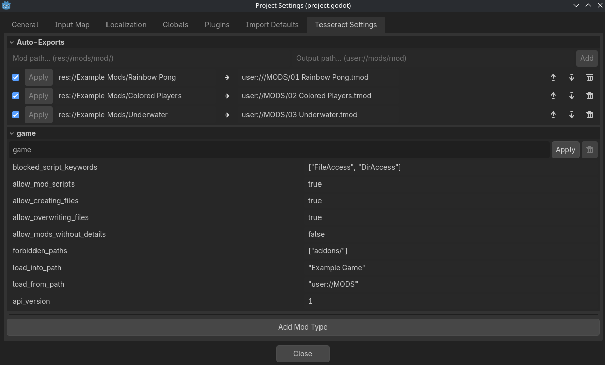

<div align="middle">

</img>

**Version:** 2.0.0

Tesseract is a mod loader for Godot 4.6 that gives both modders & game developers the tools they need to easily implement seamless mods.

</div>

---

# Table of contents
- [Features](#features)
  - [Load from ZIP or folder](#load-from-zip-or-folder)
  - [No unnecessary bundling](#no-unnecessary-bundling)
  - [Editor integration](#editor-integration)
  - [Runtime unloading](#runtime-unloading)
  - [Browse mod files & directories](#browse-mod-files--directories)
  - [Extensive sandboxing](#extensive-sandboxing)
  - [Detailed metadata](#detailed-metadata)
- [Downsides](#downsides)
  - [No import configuration](#no-import-configuration)
- [Plugin settings](#plugin-settings)
- [Install & use mods](#install-&-use-mods)
- [Create a basic mod](#create-a-basic-mod)
- [A guide on creating moddable games](#a-guide-on-creating-moddable-games)
- [Games with Tesseract support](#games-with-tesseract-support)

# Features
## Load from ZIP or folder
Tesseract can load mods from ZIP (or TMOD) files, as well as straight from a folder containing all the mod's content.

Loading from folder is my favorite way for quick testing, you just drag the folder sraight from your Godot project then into the game's designated mods folder, no exporting, no packing, it's simple.

### ZIP Pros:
- Comressable size. Not very helpful for small mods though.
- Easier to transfer & share as it is a singular file.
### ZIP Cons:
- Harder to modify directly.
- Takes extra time to unpack & read. This can make a noticeable difference loading 10+ zipped mods versus 10+ unzipped mods.

## No unnecessary bundling
Unlike with PCKs, Tesseract mods don't have to bundle in every asset it uses from the base game, you can just use it & as long as it stays available in the base game you have nothing to worry about.
Although if you'd like, you can still bundle game assets into your mod, but beware it will overwrite the base game's original file.

## Editor integration
One of my goals for Tesseract is for development to be as frictionless as humanly possible. That's why Tesseract offers multiple in-editor tools that make it much easier to develop for than alternatives. 

### Context menu export
File system context menu option that opens a file save dialog for packing & exporting the selected mod as a TMOD ZIP file.
Useful for quickly sharing your packaged mod.

### Context menu mod creation
File system context menu option that opens a dialog that lets you input basic information to automatically create a new mod directory with all required files added.
This way, you won't need to constantly refer to the documentation to create a new mod.

### Auto-exporting
The very last tab in project settings should be a tab called "Tesseract Settings", in that tab you can add & manage a list of mods that will automatically be re-exported to the given location (as TMOD, ZIP or folder) before running the project. This is very useful for quick prototyping & brings mods one step closer to being just as good as native resources in the editor.

## Runtime unloading
Tesseract allows you to unload individual mods to restore original resources in the virtual file system.
However, unloading has a few edge cases where the resources continue to be referenced well after unloading due to how the merging system works. To enure everything works smoothly it is recommended to unload ALL mods then reload the mods you want to keep loaded, although if you aren't experiencing issues it is fine to unload individual mods without reloading all the other mods.

## Browse mod files & directories
Godot PCKs just merge into the virtual file system with no easy way to get the specific files or directories added or changed.
To address this, Tesseract implements convenient methods for getting all directories & file paths any specific mod has contributed.

## Extensive sandboxing
Game developers can specify "mod types" each with their own set of permissions, any mod that specifies a mod type will inherit it's permissions.
They can also choose where in the virtual file system mod files are loaded into, regulate / block script usage, & choose which files mods are allowed to overwrite.

By "regulate script usage" I mean you can either outright block all use of built-in & external scripts, or you can add blocked keywords which while not a full solution does help deter mallicious actors.

## Detailed metadata
Tesseract mods use `.cfg` files as their manifest, making it easy to integrate & read from within your game. Mods are also loaded as a unique `TesseractMod` object that holds all the metadata, & also can be interacted with if the mod has an entry point script.

Mods are not required to specify all possible metadata values, just the bare minimum like name, version, & compatible Tesseract / game versions.
Here is a list of all built-in metadata fields:
- *id: String
- *version_number: int
- *for_game_versions: Array\[Variant\]
- *for_tesseract_versions: Array\[int\]
- name: String
- author: String
- description_short: String
- description_long: String
- version_string: String
- source: String (URL)
- mod_dependencies: Array\[String\]
- real_path: String
- priority_paths: Array\[String\]
- direct_source: String (URL)

Mods can provide any additional metadata fields they want.


# Downsides
## No import configuration
Usually you'll find `.import` files next to assets like images & audio files. These files can be exported into a mod but they will not be used. Import config files tell Godot how it should import an asset & what changes it should make before integrating it. At the moment Godot does expose any API to parse & apply import config files, luckily they are raw text `ini` styled files so reading them is very straight-forward, however applying changes to the resource is not.

This might be implemented sooner or later, it all depends on the demand from myself or others.


# Plugin settings
You technically do not need to change the plugin's configurtion for it to work as expected, but it is definitely worth taking a look for features you might find useful.

There are 2 ways you can edit the configuration, the first (& recommended) way to do this is through the "Tesseract Settings" tab in project settings. It is the most convenient & you don't have to worry about messing up the file's config format.
The second way is to directly modify the `res://addons/Tesseract/plugin.cfg` file, though you must be careful not to break anything.

You can create new mod types & set individual rule overrides for that mod type. Otherwise all mods will use the global settings.

</img>

### Auto-export config
Add, modify, & toggle auto-exports. You can choose exactly where they should export to. All enabled auto-exports will be exported to it's set location the next time you run the project in the editor.

### API version
This integer determines the version of your game's API (or API version for a specific mod type if set within a mod type group), this should be updated to a higher value every time you publish your game with compatiility-breaking mod API changes.

### Load from path
The directory in which mods should be loaded from in the production version of your game. By default it is set to be in the game's "user data" directory under the "MODS" folder (`user://MODS/`).

### Load into path
The directory to load all mods into in the virtual file system (`res://`).
If path ends with "*" will put the mod into a sub-directory with the name of the mod (or file name if details are unavailable).

The path should not be an absolute path, or start with `res://` or `user://`. The directory is already assumed to be in `res://`.

### Forbidden paths
Paths in `res://` which mods are not allowed to add to or modify. Can be a file path or directory path (must end with "/" to be considered a directory). By default the `addons/` path is in this list so mods cannot modify any of your game's Godot plugins.

This only stops files directly from the mod from being imported if it ends up in a forbidden path, this does *not* stop a script from within the mod accessing or overwriting resources in any location.

### Allow mods without details
If set to `true` (by default `false`), allow mods to be imported without having a valid confuration file. However mods without configuration will not be available to your game, but their changes will still be applied. Generally not recommended to change this setting.

### Allow overwriting files
If set to `true` (by default `true`), allow mods to overwrite existing files in the virual file system.
When `false` this does *not* stop a script from within the mod overwriting files.

### Allow creating files
If set to `true` (by default `true`), Tesseract will allow mods to create new files in the virual file system.
When `false` this does *not* stop a script from within the mod creating files.

### Allow mod scripts
If set to `true` (by default `true`), allow mods to include & run scripts (GDScript).

### Blocked script keywords
List of keywords that if found in a script will not load that script.
This can (to an extent) be used to prevent the use of dangerous classes & autoload singletons.

Workarounds:
- ClassDB.class_call_static (Calling class methods through the ClassDB)
- Engine.get_singleton (Getting singletons from the engine singleton)
- GDScript. (Runtime script construction, to prevent scripts from being created at runtime it is necessary to block ALL GDScript methods)

To prevent these workarounds, use this list: `["ClassDB.", "Engine.", "GDScript."]`

There are very well more workarounds that have not been or can not be accounted for.
But this should be enough to deter most people from writing mallicious code.

### (For mod types) priority
Load order priority, lower valued mod types will load their mods before higher valued mod types.


# Install & use mods
For the end user, installing mods should be as simple & seamless as possible. The user only has 2 things they need to do, or if your game has built-in mod management (importing, reordering & toggling) 0 things!

1. Throw the TMOD file or mod folder into the game's dedicated mods folder (usually at `user://MODS`).
2. Rename the file/folder to start with the load order for that mod. For example to load any mod *before* all other mods the name should start with the number "1".
   It works like this because mods are loaded alphabetically based on their file/folder name.


# Create a basic mod
If you are familiar with Godot 4.0 then creating a Tesseract mod will be a breeze.
To get started open a brand new project in Godot 4 with Tesseract installed. Developers may provide a dedicated Godot project for modders, use that if possible.

Create a new folder anywhere in your project to hold all the files for your mod, this will be referenced as the root directory of your mod.

## Create a config file
For (most) games that support Tesseract, mods require a configuration file that specifies a unique name, a type, version, & optionally an author.
Depending on the game, they may have you specify additional parameters for your mod.

Here is what a basic config file looks like:
```ini
[TesseractMod]
; Unique mod identifier. This should be somethig highly unlikely to be used in other mods.
; Prefixing the ID with the author name is a good way of differentiating mods with the same name.
id="My Mod by John Doe"
; Mod display name.
name="My Mod"
; Author of the mod.
author="John Doe"
; String representation of the mod version.
version_string="1.0.0"
; Short description.
description_short="Short description of this mod."
; Long description.
description_long="Long description of this mod, should include a list of all changes made."
; Public link to the mod.
; Can be a store or repository hosting the mod.
source=""

; Version of the mod.
version_number=1
; All game API versions this mod is expected to work for.
for_game_versions=[1]
; All Tesseract versions this mod is expected to work for.
for_tesseract_versions=[1]
; Optional. Mod IDs that must be present & loaded before this mod.
mod_dependencies=[]
; Direct link to a repository hosting the mod's files.
; This can be used to automatically check for updates & update the mod if the direct source is correct.
direct_source=""

; The path being used for development. To get this path right click on the root directory of the mod & select "Copy Path".
; This will be used to map resource paths for use inside of this mod.
; It is VERY important that this path is accurate, does not conflict with other mods, & does not conflict with of the game's paths either.
; Set this path to empty if you do not reference any mod resources in your mod.
real_path="res://Example Mods/My Mod by John Doe"
; Resources that will be loaded before everything else. Use this to define load order.
; Paths should be relative to the mod root directory.
priority_paths=[]
```

Your config file should be located in the *root directory of your mod* & have the exact name `MOD.cfg`.

## Create an init script
This step is completely optional & depends on whether or not the game you are developing for supports scripts inside mods.
You only need to do this if you want to connect to the game's API signals &/or if you want to run custom logic during mod initialization.

Here is what a basic init script looks like:
```gdscript
extends TesseractMod


func init() -> void:
	print('%s mod successfuly activated!!' % name)


func recieve_signal(_signal_name:String, ..._args) -> void:
	pass
```

Your script file should be located in the *root directory of your mod* & have the exact name `INIT.gd`.

## Adding content
Files in your mod are directly imported into the virtual file system of the game, this means things can be overwritten & can break if you aren't careful (given that the game is very permissive of mods).
Always follow the game's documentation for locations to put your mod files.

Referencing resources from inside your mod (I.E a scene relying on a script only present inside your mod) is fine & will work so long as you have correctly set the mod's `real_path` config value & it is not overlapping with any other paths that may be present in other mods or in the game.

It is recommended to include a `.paths` text file in the root directory of your mod containing a list of all files in your mod as relative paths. This way if you have a direct source configured & the direct source contains your mod files, then the game can implement functions to check for updates & even download new versions of your mod.
An example `.paths` file would look like this:
```
MOD.cfg
Assets/example.tres
```

There is not anything else to say here, the rest is up to the game itself to document.

## Export
Tesseract lets you export your mod directly from the Godot editor, just right click the folder holding the mod then select the "Export TMOD" option near the bottom. The option will only show up for folders containing a valid mod. Selecting the "Export TMOD" option will open a file save dialog menu where you can choose where to save the zipped mod.

Exported mods do not include UID files or any editor specific files that will not be used in the actual mod.

# A guide on creating moddable games
Slapping on a mod manager to your game doesn't automatically make it easily moddable. Here are some general rules you should follow to ensure a straight forward experience for modders.

## Define a clear file structure
Your game files should be clearly laid out & folder names should be self explanatory. Avoid obscure or confusing naming schemes.
For example all your games scenes should usually be in a single "Scenes" folder, same goes for scripts, textures, models, & other elements.

## Keep things modular
Always try to keep everything as separated & reusable as humanly possible! A scene with all it's scripts, resources, & settings built into itself is not a very moddable one.

Not only will separating things help with reusability, organization, & modification, but it also allows modders to change a single thing without breaking after another mod gets added or after you update your game.

## Provide documentation for modders
Modders don't just know your project's file structure & APIs off the top of their head, you need to provide them with that knowledge, **especially if your game is closed source**.

# Games with Tesseract support
Here is a list of all games released that are using Tesseract for modding support!

Open a pull request or issue to request the addition of your game.

